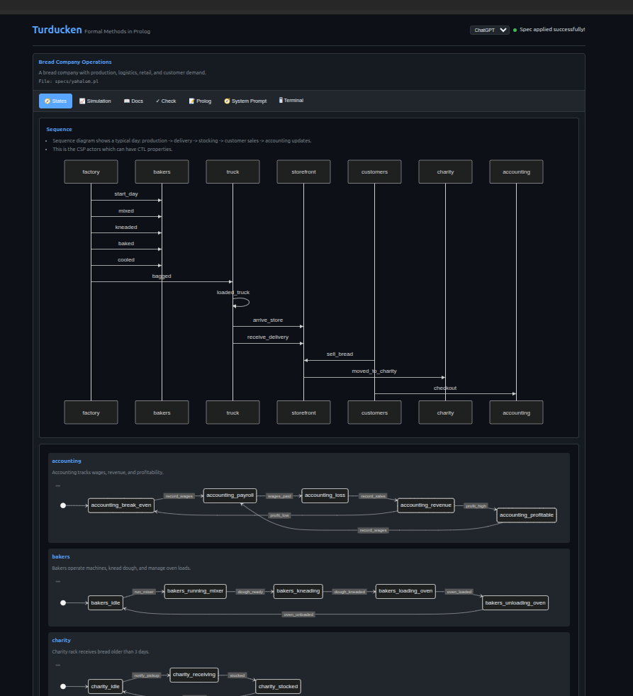

# Turducken

Formal methods tool using Prolog as the specification language. A single Go binary that serves a web UI for arguing with an LLM about specifications.

## Architecture

```
┌─────────────────────────────────────────────────────────┐
│                    Web UI (Dark Mode)                    │
├─────────────────────────────────────────────────────────┤
│  Chat │ Query │ Check │ Visualize                        │
└───────────────────────────┬─────────────────────────────┘
                            │
┌───────────────────────────▼─────────────────────────────┐
│                   Go HTTP Server                         │
├─────────────────────────────────────────────────────────┤
│  /api/spec     - Load/update Prolog specification        │
│  /api/query    - Execute Prolog queries                  │
│  /api/check    - Verify CTL properties                   │
│  /api/chat     - LLM conversation                        │
│  /api/visualize - Extract visualization data             │
└───────────────────────────┬─────────────────────────────┘
                            │
┌───────────────────────────▼─────────────────────────────┐
│             ichiban/prolog Interpreter                   │
├─────────────────────────────────────────────────────────┤
│  - CTL model checking (EF, AF, EG, AG, EU, AU, EX, AX)  │
│  - CSP-style channels (buffered, send/recv)              │
│  - Process algebra (recursive equations)                 │
│  - Visualization extraction predicates                   │
└─────────────────────────────────────────────────────────┘
```

## Quick Start

```bash
# Build
go build -o turducken ./cmd/turducken

# Run with web UI
./turducken -port 8080

# Run with a spec file
./turducken -spec specs/two_phase_commit.pl
```

Open http://localhost:8080 in your browser.

## Prolog Specification Language

### State Machines

```prolog
state(name, [prop1, prop2]).     % State with properties
transition(from, label, to).     % Labeled transition
initial(state).                  % Mark initial state
accepting(state).                % Mark accepting state
prop(state, property).           % State satisfies atomic prop
```

### CTL Model Checking

```prolog
% Check from initial state
check_ctl(Formula).

% Formulas:
%   atom(p)        - atomic proposition
%   not(F)         - negation
%   and(F1, F2)    - conjunction
%   or(F1, F2)     - disjunction
%   ex(F)          - exists next
%   ax(F)          - all next
%   ef(F)          - exists finally (reachability)
%   af(F)          - all finally (inevitable)
%   eg(F)          - exists globally
%   ag(F)          - all globally (invariant)
%   eu(F1, F2)     - exists until
%   au(F1, F2)     - all until
```

### CSP-Style Channels

```prolog
channel(name, capacity).         % Declare buffered channel
send(chan, msg, s1, s2).        % Send transition
recv(chan, msg, s1, s2).        % Receive transition
```

### Process Algebra (Recursive Equations)

```prolog
proc(Name, Definition).

% Definitions:
%   stop                    - deadlock
%   skip                    - successful termination
%   prefix(event, P)        - event then P
%   choice(P1, P2)          - external choice
%   parallel(P1, P2)        - parallel composition
```

### Sequence Diagrams

Sequence views are derived from channel usage (`send/4`, `recv/4`) and annotations.

You can add message formats to show explicit data on the edges:

```prolog
message_format(req_ab_na, 'A,B,Na').
message_format(ticket_kab, 'Kab,ticket_b').
```

### Charts

```prolog
pie_slice(label, value).         % Pie chart slice
line_point(series, x, y).        % Line chart point
bar_value(label, value).         % Bar chart value
```

## LLM Integration

Set the `ANTHROPIC_API_KEY` environment variable to enable AI-powered specification generation:

```bash
export ANTHROPIC_API_KEY=your-key-here
./turducken
```

Then use the Chat tab to describe systems in natural language. The LLM will generate Prolog specifications that you can apply and verify.

## Example Specifications



See the `specs/` directory for examples:

- `two_phase_commit.pl` - Two-phase commit protocol with actors and channels

## Development

```bash
# Get dependencies
go mod download

# Run tests
go test ./...

# Build for release
go build -ldflags="-s -w" -o turducken ./cmd/turducken
```

## Design Philosophy

1. **Prolog is the source of truth** - All specifications live in Prolog, not custom DSLs
2. **CTL model checking in Prolog** - Temporal logic implemented as Prolog predicates
3. **CSP semantics** - Message passing modeled after Hoare's CSP
4. **Dark mode first** - Designed for extended use without eye strain
5. **Single binary** - Everything embedded, no external dependencies at runtime

## License

MIT
